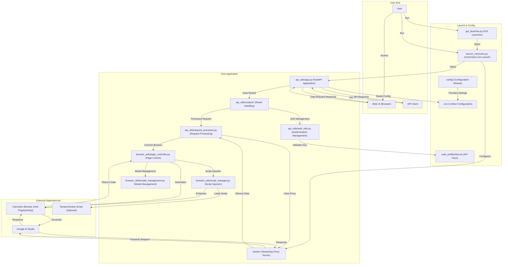

# AI Studio Proxy API

This is a Python-based proxy server that converts Google AI Studio's web interface into an OpenAI-compatible API. Through Camoufox (anti-fingerprinting Firefox) and Playwright automation, it provides stable API access

This fork is the primary English version of the original project.

This project is generously sponsored by ZMTO. Visit their website: [https://zmto.com/](https://zmto.com/)

This project is generously sponsored by ZMTO with server support. Visit their website: [https://zmto.com/](https://zmto.com/)

---

## Acknowledgements

The birth and development of this project cannot be separated from the generous support and wisdom contributions of the following individuals, organizations, and communities:

- **Project initiation and main development**: @CJackHwang ([https://github.com/CJackHwang](https://github.com/CJackHwang))
- **Feature enhancement and page operation optimization ideas**: @ayuayue ([https://github.com/ayuayue](https://github.com/ayuayue))
- **Real-time streaming functionality optimization and improvement**: @luispater ([https://github.com/luispater](https://github.com/luispater))
- **3400+ line main file project refactoring great contribution**: @yattin (Holt) ([https://github.com/yattin](https://github.com/yattin))
- **High-quality project maintenance in later stages**: @Louie ([https://github.com/NikkeTryHard](https://github.com/NikkeTryHard))
- **English version maintainer**: @MasuRii ([https://github.com/MasuRii](https://github.com/MasuRii))
- **Community support and inspiration**: Special thanks to the [Linux.do Community](https://linux.do/) members for their enthusiastic discussions, valuable suggestions, and problem feedback - your participation is an important driving force for the project's progress.

At the same time, we sincerely thank every friend who has silently contributed to this project through submitting Issues, providing suggestions, sharing usage experiences, contributing code fixes, and other ways. It is your joint efforts that make this project better!

---

**This is the currently maintained Python version. The deprecated JavaScript version can be found in [`deprecated_javascript_version/README.md`](deprecated_javascript_version/README.md).**

## 📊 Compatibility Matrix

| Component | Version Requirements | Recommended Version | Description |
|----------|---------------------|---------------------|-------------|
| **Python** | ≥3.9, <4.0 | 3.10+ or 3.11+ | Docker environment uses 3.10 |
| **Operating System** | Windows / macOS / Linux | - | Full cross-platform support, Docker supports x86_64 and ARM64 |
| **Memory** | ≥2GB | ≥4GB | Browser automation required |
| **Network** | Stable internet connection | - | Configurable proxy to access Google AI Studio |
| **Dependency Management** | Poetry | Latest version | Modern Python dependency management tool |
| **Type Checking** | Pyright (optional) | Latest version | Used for type checking and IDE support during development |

## System Requirements

- **Python**: >=3.9, <4.0 (recommend 3.10+ for best performance, Docker environment uses 3.10)
- **Dependency Management**: [Poetry](https://python-poetry.org/) (modern Python dependency management tool, replacement for traditional requirements.txt)
- **Type Checking**: [Pyright](https://github.com/microsoft/pyright) (optional, used for type checking and IDE support during development)
- **Operating System**: Windows, macOS, Linux (full cross-platform support, Docker deployment supports x86_64 and ARM64)
- **Memory**: Recommend 2GB+ available memory (browser automation required)
- **Network**: Stable internet connection to access Google AI Studio (proxy configuration supported)

## Main Features

- **OpenAI Compatible API**: Supports `/v1/chat/completions` endpoint, fully compatible with OpenAI clients and third-party tools
- **Three-Layer Streaming Response Mechanism**: Integrated streaming proxy → external Helper service → Playwright page interaction multiple guarantees
- **Smart Model Switching**: Dynamically switch models in AI Studio through the `model` field in API requests
- **Complete Parameter Control**: Supports all major parameters like `temperature`, `max_output_tokens`, `top_p`, `stop`, `reasoning_effort`
- **Anti-Fingerprinting Detection**: Uses Camoufox browser to reduce the risk of being detected as automated scripts
- **Script Injection Feature v3.0**: Uses Playwright native network interception, supports Tampermonkey script dynamic mounting, 100% reliable 🆕
- **Modern Web UI**: Built-in testing interface, supports real-time chat, status monitoring, hierarchical API key management
- **Graphical Interface Launcher**: Provides feature-rich GUI launcher, simplifying configuration and process management
- **Flexible Authentication System**: Supports optional API key authentication, fully compatible with OpenAI standard Bearer token format
- **Modular Architecture**: Clear modular separation design, api_utils/, browser_utils/, config/ and other independent modules
- **Unified Configuration Management**: Based on `.env` file unified configuration, supports environment variable overrides, Docker compatible
- **Auth profile smart rotation**: Automatically rotates authentication profiles to avoid rate limits and improve stability.
- **Quota detection with graceful shutdown**: The system can detect when a quota is reached and will gracefully shut down services to prevent errors.
- **Modern Development Tools**: Poetry dependency management + Pyright type checking, providing excellent development experience

## System Architecture



## 🚀 Quick Start

New users are recommended to follow the **[Quick Start Guide](docs/quick-start-guide.md)** for deployment, which should take 15-30 minutes to complete.

### Three-Step Quick Deployment

```bash
# 1️⃣ Clone and install
git clone https://github.com/CJackHwang/AIstudioProxyAPI.git
cd AIstudioProxyAPI
poetry install  # Automatically creates virtual environment and installs dependencies

# 2️⃣ Configure environment
cp .env.example .env
nano .env  # Edit configuration (optional, default configuration can be used)

# 3️⃣ Initial authentication and start
poetry run python launch_camoufox.py --debug  # Initial authentication (requires Google login)
# After successful authentication, press Ctrl+C to stop, then run in headless mode:
poetry run python launch_camoufox.py --headless
```

### Quick Test

```bash
# Health check
curl http://127.0.0.1:2048/health

# Get model list
curl http://127.0.0.1:2048/v1/models

# Test chat (non-streaming)
curl -X POST http://127.0.0.1:2048/v1/chat/completions \
  -H "Content-Type: application/json" \
  -d '{"model":"gemini-2.5-pro","messages":[{"role":"user","content":"Hello"}]}'

# Test streaming chat
curl -X POST http://127.0.0.1:2048/v1/chat/completions \
  -H "Content-Type: application/json" \
  -d '{"model":"gemini-2.5-pro","messages":[{"role":"user","content":"Tell me a story"}],"stream":true}' --no-buffer
```

### Access Web UI

Open your browser and navigate to `http://127.0.0.1:2048/` to use the built-in web chat interface.

---

## 📦 Installation & Dependency Management

### Prerequisites

- Python 3.9+ (recommend 3.10 or 3.11)
- 2GB+ available memory
- Stable internet connection

### One-Click Installation Script

**macOS/Linux**:
```bash
curl -sSL https://raw.githubusercontent.com/CJackHwang/AIstudioProxyAPI/main/scripts/install.sh | bash
```

**Windows (PowerShell)**:
```powershell
iwr -useb https://raw.githubusercontent.com/CJackHwang/AIstudioProxyAPI/main/scripts/install.ps1 | iex
```

### Manual Installation Steps

#### 1. Install Poetry

```bash
# macOS/Linux
curl -sSL https://install.python-poetry.org | python3 -

# Windows (PowerShell)
(Invoke-WebRequest -Uri https://install.python-poetry.org -UseBasicParsing).Content | py -
```

#### 2. Clone Project

```bash
git clone https://github.com/CJackHwang/AIstudioProxyAPI.git
cd AIstudioProxyAPI
```

#### 3. Install Dependencies

```bash
poetry install
```

#### 4. Install Browser and Camoufox

```bash
# Activate Poetry environment
poetry shell

# Install Playwright browser
playwright install firefox

# Download Camoufox data files
camoufox fetch
# Or use alternative method
python fetch_camoufox_data.py
```

### Using uv or pip (Optional)

```bash
# Export requirements.txt
poetry export -f requirements.txt --output requirements.txt --without-hashes

# Use uv (faster)
pip install uv
uv pip install -r requirements.txt

# Use pip (traditional)
pip install -r requirements.txt
```

---

## 🎮 Running & Debugging

### Daily Running Modes

| Command | Description | Applicable Scenarios |
|---------|-------------|---------------------|
| `python gui_launcher.py` | GUI launcher | New users, visual configuration |
| `python launch_camoufox.py --headless` | Headless mode | Daily use, servers |
| `python launch_camoufox.py` | Normal mode | View browser window |
| `python launch_camoufox.py --debug` | Debug mode | Initial authentication, troubleshooting |
| `python launch_camoufox.py --virtual-display` | Virtual display mode | Linux non-GUI environment |

### Direct FastAPI Start (Development & Debugging)

```bash
# Need to manually configure CAMOUFOX_WS_ENDPOINT environment variable first
export CAMOUFOX_WS_ENDPOINT=ws://127.0.0.1:9222
uvicorn server:app --host 0.0.0.0 --port 2048
```

### View Logs

```bash
# Real-time logs
tail -f logs/app.log

# Error logs
grep -i error logs/app.log

# Launch logs
tail -f logs/launch_app.log
```

### Common Command Line Arguments

```bash
python launch_camoufox.py --help

Common options:
  --headless              Run in headless mode
  --debug                 Debug mode (show browser window)
  --virtual-display       Use virtual display (Linux no GUI)
  --server-port PORT      FastAPI port (default 2048)
  --stream-port PORT      Streaming proxy port (default 3120)
  --internal-camoufox-proxy URL  Browser proxy address
```

---

## ⚙️ Configuration Management

The project uses `.env` file for configuration management, with all configuration items centrally managed, no need for complex command line parameters.

### Quick Configuration

```bash
# 1. Copy configuration template
cp .env.example .env

# 2. Edit configuration file
nano .env  # or use other editor
```

### Main Configuration Categories

| Category | Example Configuration | Description |
|----------|----------------------|-------------|
| **Port Configuration** | `PORT=2048` | FastAPI service port |
| | `STREAM_PORT=3120` | Streaming proxy port (set to 0 to disable) |
| **Proxy Configuration** | `UNIFIED_PROXY_CONFIG=http://127.0.0.1:7890` | HTTP/HTTPS proxy |
| **Log Configuration** | `SERVER_LOG_LEVEL=INFO` | Log level (DEBUG/INFO/WARNING) |
| | `DEBUG_LOGS_ENABLED=false` | Enable debug logs |
| **API Parameters** | `DEFAULT_TEMPERATURE=1.0` | Default temperature parameter |
| | `DEFAULT_MAX_OUTPUT_TOKENS=65536` | Default max output tokens |
| **Timeout Configuration** | `RESPONSE_COMPLETION_TIMEOUT=300000` | Response timeout (milliseconds) |
| **Authentication Configuration** | `AUTO_SAVE_AUTH=false` | Auto-save authentication files |

### Configuration Advantages

- ✅ **Worry-free version updates**: Configuration preserved after `git pull`, no need to reconfigure
- ✅ **Simplified startup command**: Start with one command, no long parameter lists
- ✅ **Security**: `.env` is ignored by `.gitignore`, won't leak sensitive information
- ✅ **Docker compatible**: Same configuration method for Docker and local use

### Configuration Documentation

- **[Environment Configuration Guide](docs/environment-configuration.md)** - Configuration management and usage methods ⭐
- **[Complete Environment Variables Reference](docs/env-variables-reference.md)** - Detailed description of all configuration items 📋

---

## 📚 Detailed Documentation

#### 🚀 Quick Start

- **[Quick Start Guide](docs/quick-start-guide.md)** - 15-minute quick deployment and testing 🎯
- [Installation Guide](docs/installation-guide.md) - Detailed installation steps and environment configuration
- [Environment Configuration Guide](docs/environment-configuration.md) - .env file configuration management ⭐
- [Complete Environment Variables Reference](docs/env-variables-reference.md) - Detailed description of all configuration items 📋
- [Authentication Setup Guide](docs/authentication-setup.md) - Initial run and authentication file setup
- [Daily Usage Guide](docs/daily-usage.md) - Daily use and configuration options

#### 🔧 Feature Usage

- [API Usage Guide](docs/api-usage.md) - API endpoints and client configuration
- **[OpenAI Compatibility Guide](docs/openai-compatibility.md)** - Differences and limitations with OpenAI API 🔄
- **[Client Integration Examples](docs/client-examples.md)** - Python, JavaScript, cURL and other example code 💻
- [Web UI Usage Guide](docs/webui-guide.md) - Web interface feature description
- [Script Injection Guide](docs/script_injection_guide.md) - Tampermonkey script dynamic mounting feature usage guide (v3.0) 🆕

#### ⚙️ Advanced Configuration

- [Streaming Modes Detailed](docs/streaming-modes.md) - Detailed explanation of three-layer response acquisition mechanism 🆕
- [Advanced Configuration Guide](docs/advanced-configuration.md) - Advanced features and configuration options
- [Logging Control Guide](docs/logging-control.md) - Log system configuration and debugging
- [Troubleshooting Guide](docs/troubleshooting.md) - Common problem solutions

#### 🌍 Platform & Deployment

- [Platform Differences](docs/platform-differences.md) - Windows/macOS/Linux differences and considerations
- [Docker Deployment Guide (docker/README-Docker.md)](docker/README-Docker.md) - Complete containerized deployment process
- [Docker Quick Guide (docker/README.md)](docker/README.md) - One-click Compose start

#### 🛠️ Development Related

- [Project Architecture Guide](docs/architecture-guide.md) - Modular architecture design and component details 🆕
- [Developer Guide](docs/development-guide.md) - Poetry, Pyright and development workflow
- [Dependency Versions Guide](docs/dependency-versions.md) - Poetry dependency management and version control detailed explanation

## Client Configuration Example

Taking Open WebUI as an example:

1. Open Open WebUI
2. Go to "Settings" -> "Connection"
3. In the "Model" section, click "Add Model"
4. **Model Name**: Enter the name you want, for example `aistudio-gemini-py`
5. **API Base URL**: Enter `http://127.0.0.1:2048/v1`
6. **API Key**: Leave empty or enter any characters
7. Save settings and start chatting

---

## 🐳 Docker Deployment

This project supports deployment through Docker, using **Poetry** for dependency management, **fully supports `.env` configuration files**!

> 📁 **Note**: All Docker-related files have been moved to the `docker/` directory to keep the project root directory clean.

### 🚀 Quick Docker Deployment

```bash
# 1. Prepare configuration file
cd docker
cp .env.docker .env
nano .env  # Edit configuration

# 2. Start using Docker Compose
docker compose up -d

# 3. View logs
docker compose logs -f

# 4. Version update (in docker directory)
bash update.sh
```

### 📚 Detailed Documentation

- [Docker Deployment Guide (docker/README-Docker.md)](docker/README-Docker.md) - Contains complete Poetry + `.env` configuration instructions
- [Docker Quick Guide (docker/README.md)](docker/README.md) - Quick start guide

### ✨ Docker Features

- ✅ **Poetry Dependency Management**: Uses modern Python dependency management tool
- ✅ **Multi-stage Build**: Optimizes image size and build speed
- ✅ **Unified Configuration**: Uses `.env` file to manage all configurations
- ✅ **Version Updates**: Simply run `bash update.sh` to complete updates
- ✅ **Clean Directory**: Docker files moved to `docker/` directory
- ✅ **Cross-platform Support**: Supports x86_64 and ARM64 architectures
- ⚠️ **Authentication Files**: First run needs to obtain authentication files on the host, then mount to container

---

## About Camoufox

This project uses [Camoufox](https://camoufox.com/) to provide browser instances with enhanced anti-fingerprinting capabilities.

- **Core Goal**: Simulate real user traffic, avoid being identified as automated scripts or bots
- **Implementation**: Camoufox is based on Firefox, modifying the browser's underlying C++ implementation to disguise device fingerprints (such as screen, OS, WebGL, fonts, etc.), rather than using JavaScript injection which is easily detected
- **Playwright Compatible**: Camoufox provides Playwright-compatible interfaces
- **Python Interface**: Camoufox provides Python packages, can start service through `camoufox.server.launch_server()`, and control through WebSocket connections

The main purpose of using Camoufox is to improve stealth when interacting with AI Studio web pages, reducing the possibility of being detected or limited. However, please note that no anti-fingerprinting technology is absolutely perfect.

## 🔑 Core Concepts

### Runtime Component Description

AI Studio Proxy API consists of multiple components working together to provide complete proxy service:

#### 1. FastAPI Main Server (`server.py`)

**Purpose**: Provides OpenAI-compatible REST API endpoints

**Functions**:
- Handle API requests like `/v1/chat/completions`, `/v1/models`
- Manage request queues and concurrency control
- Provide Web UI and health check endpoints
- Handle API key authentication

**Startup Method**:
```bash
# Auto-start through launch_camoufox.py (recommended)
python launch_camoufox.py --headless

# Or direct start (needs manual browser endpoint configuration)
uvicorn server:app --host 0.0.0.0 --port 2048
```

**Port Configuration**: `PORT` or `DEFAULT_FASTAPI_PORT` in `.env`

#### 2. Camoufox Browser (Anti-Fingerprinting)

**Purpose**: Provides Firefox browser instance with anti-fingerprinting capabilities

**Functions**:
- Simulate real user traffic, reduce detection risk
- Disguise device fingerprints through modified browser underlying C++ code
- Provide Playwright-compatible WebSocket endpoints
- Automatically access and operate Google AI Studio pages

**Startup Method**: Auto-started and managed through `launch_camoufox.py`

**Port Configuration**: `DEFAULT_CAMOUFOX_PORT` in `.env` (default 9222)

**Connection Method**: Playwright connects through WebSocket (like `ws://127.0.0.1:9222`)

#### 3. Playwright Automation Engine

**Purpose**: Controls browser to perform automation operations

**Functions**:
- Manage AI Studio page interactions (input prompts, extract responses)
- Dynamically switch models
- Set model parameters (temperature, max_tokens, etc.)
- Capture errors and generate snapshots

**Integration Method**: Initialized when FastAPI application starts, connecting to Camoufox browser

#### 4. Integrated Streaming Proxy Service (`stream/`)

**Purpose**: Provides low-latency streaming response proxy

**Functions**:
- Directly forward AI Studio's streaming responses, reducing latency
- Runs as proxy server locally (`127.0.0.1:3120`)
- Supports self-signed certificate management (`certs/` directory)
- Serves as the first layer of three-layer response acquisition mechanism

**Startup Method**: Auto-starts independent process when FastAPI application starts

**Port Configuration**: `STREAM_PORT` in `.env` (default 3120, set to `0` to disable)

**Workflow**:
```
Client Request → FastAPI → Stream Proxy → AI Studio
                ↓            ↓
         (Backup) Playwright Page Interaction
```

#### 5. GUI Launcher (`gui_launcher.py`) (Optional)

**Purpose**: Provides graphical startup and configuration interface

**Functions**:
- Visual configuration of ports, proxies, authentication and other options
- One-click start/stop all services
- Real-time log output viewing
- Manage multiple configuration presets

**Startup Method**:
```bash
python gui_launcher.py
```

### Three-Layer Response Acquisition Mechanism & Parameter Control

The project adopts an innovative three-layer response acquisition mechanism, balancing performance and reliability:

#### Response Acquisition Priority

1. **First Layer: Integrated Streaming Proxy Service** (enabled by default)
   - ⚡ **Optimal Performance**: Directly forwards streaming responses, lowest latency
   - 📍 **Port**: 3120 (configurable through `STREAM_PORT`)
   - ✅ **Applicable Scenarios**: Streaming requests, real-time conversation
   - ⚠️ **Limitations**: Limited parameter support, mainly supports basic parameters

2. **Second Layer: External Helper Service** (optional configuration)
   - 🔧 **Requires**: Valid authentication file (`auth_profiles/active/*.json`)
   - 📡 **Configuration**: Through `--helper <endpoint>` or `.env` configuration
   - ✅ **Applicable Scenarios**: Scenarios requiring additional features
   - ⚠️ **Limitations**: Depends on Helper service implementation

3. **Third Layer: Playwright Page Interaction** (final fallback)
   - 🎯 **Complete Functionality**: Supports all parameters and model switching
   - 🔧 **Parameters**: `temperature`, `max_output_tokens`, `top_p`, `stop`, `reasoning_effort`, etc.
   - ⏱️ **Higher Latency**: Requires page operations, but most complete functionality
   - ✅ **Applicable Scenarios**: Need precise parameter control, model switching

#### Parameter Control Mechanism

| Layer | Performance | Parameter Support | Latency | Recommended Scenario |
|-------|-------------|------------------|---------|---------------------|
| Streaming Proxy | ⚡⚡⚡ | Basic parameters | Lowest | Streaming conversation, real-time response |
| Helper Service | ⚡⚡ | Depends on implementation | Medium | Specific feature requirements |
| Playwright | ⚡ | All parameters | Higher | Precise control, model switching |

#### Configuration Examples

**Enable streaming proxy** (recommended):
```env
STREAM_PORT=3120
```

**Disable streaming proxy, use Playwright**:
```env
STREAM_PORT=0
```

**Configure Helper service**:
```bash
python launch_camoufox.py --helper http://helper.example.com:8080
```

### Client Conversation History Management

**Important**: Clients are responsible for maintaining complete chat records and sending them to the proxy.

- ✅ **Support**: Clients manage conversation history, sending complete context with each request
- ❌ **Not Supported**: Editing or forking historical messages within AI Studio UI
- 📝 **Recommendation**: Use clients that support conversation management (such as Open WebUI, ChatBox, etc.)

## Future Plans

Here are some planned improvement directions:

- **Cloud Server Deployment Guide**: Provide more detailed guides for deploying and managing services on mainstream cloud platforms
- **Authentication Update Process Optimization**: Explore more convenient authentication file update mechanisms to reduce manual operations
- **Process Robustness Optimization**: Reduce error probability and approach native experience

## Contributing

Welcome to submit Issues and Pull Requests!

## License

[AGPLv3](LICENSE)

[](https://www.star-history.com/#CJackHwang/AIstudioProxyAPI&Date)

## Development is difficult, please support the author

If you find this project helpful and wish to support the author's continuous development, welcome to donate through the following methods. Your support is our greatest encouragement!


